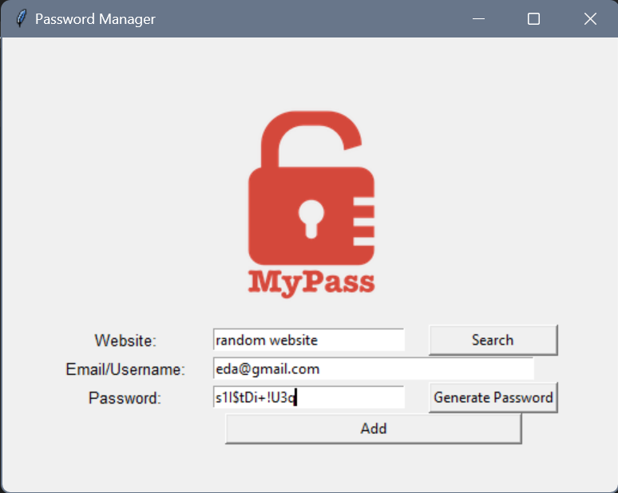
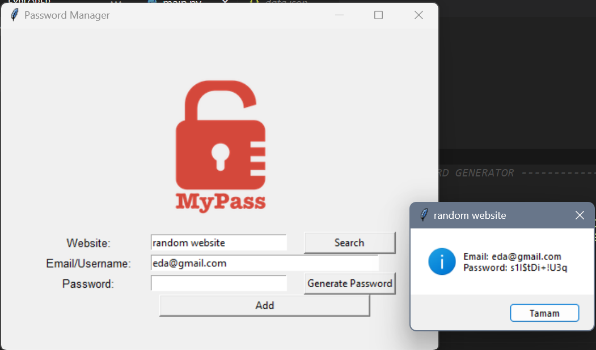

# password-generator

A simple password manager application built using Python and Tkinter. This application allows users to store and manage their website credentials securely.
# Features

Generate strong and random passwords.
Save website URLs, email/usernames, and passwords.
Search for websites and retrieve stored passwords.

# Screenshots

# Disclaimer
This password manager is a simple educational project. It is not recommended for production use. Always use a reputable, secure password manager for sensitive information.
